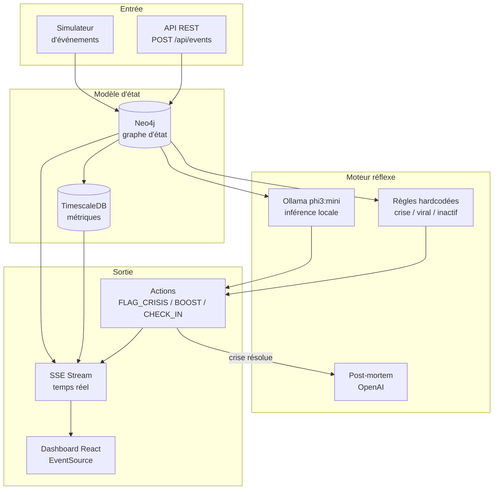

# Vigie — Agent de monitoring temps réel (Model-based reflex)

Un agent **Model-based reflex** qui surveille des contenus digitaux en temps réel : événement entrant → mise à jour du graphe d'état (Neo4j) → décision réflexe (Ollama locale) → action déclenchée → métrique enregistrée (TimescaleDB) → dashboard temps réel (SSE). Docker Compose up en 30s.

**Formats d'intégration :** Dashboard web temps réel, API REST, flux SSE temps réel. Docker Compose up en 30s.

---

## Architecture



---

## How It Works

### 1. Entry — Un événement entre dans le système

Via l'API REST :

```bash
curl -X POST http://localhost:3000/api/events \
  -H "Content-Type: application/json" \
  -d '{
    "type": "sentiment_shift",
    "contentId": "tw-1",
    "platform": "twitter",
    "payload": {"sentiment": -0.8, "velocity": 300}
  }'
```

### 2. Perception — Le graphe Neo4j se met à jour

Le World Model reçoit l'événement et met à jour le nœud Content correspondant en Cypher :

```cypher
MATCH (c:Content {id: $id})
SET c.sentiment = $sentiment, c.engagementVelocity = $velocity,
    c.status = $status
```

Chaque contenu est lié à sa plateforme par une relation `POSTED_ON`. Le statut est recalculé automatiquement (normal → warming → crisis → viral).

### 3. Décision réflexe — Règles + Ollama en local

Deux mécanismes décident en parallèle :

- **Règles hardcodées** : 3 règles (crise si sentiment < -0.5 && velocity > 50, viral si > 0.6 && shares > 20, inactif si 4h+ sans activité)
- **Ollama phi3:mini** : inférence locale (< 50ms) qui analyse le contexte sémantique du contenu

Si Ollama répond CRISIS, VIRAL, ou CHECK_IN, sa décision est prioritaire. Sinon, les règles servent de fallback.

### 4. Action — L'agent déclenche la réponse réflexe

```
CRISE: "Annonce partenariat controversé" — sentiment -0.80, 300 interactions/min
  → FLAG_CRISIS (severity: critical)
  → Diffusion immédiate sur le flux SSE

VIRAL: "Tutoriel design" — sentiment 0.70, 120 partages/min
  → BOOST_CONTENT (severity: info)
  → Suggéré comme opportunité de rebond
```

Chaque action est logguée (dédupliquée par message) et poussée en temps réel sur le dashboard.

### 5. Métrique — TimescaleDB enregistre l'état

Chaque perception enregistre une métrique dans l'hypertable :

```
time: 2026-06-09T09:33:00Z
contentId: tw-1
sentiment: -0.8
velocity: 300
status: crisis
```

Les métriques sont requêtables par fenêtre temporelle avec `time_bucket()` :

```bash
curl "http://localhost:3000/api/metrics?contentId=tw-1&window=1"
# → buckets aggrégés par minute : avg sentiment, max velocity, last status
```

### 6. Post-mortem — OpenAI analyse après résolution

Quand un contenu passe de l'état **crisis** → **normal**, l'agent déclenche automatiquement une analyse post-mortem via OpenAI (GPT-4o-mini) :

```json
{
  "contentId": "tw-1",
  "severity": "critical",
  "summary": "Crise détectée sur \"Annonce partenariat controversé\"...",
  "actions": ["FLAG_CRISIS", "FLAG_CRISIS"],
  "recommendations": ["Review monitoring thresholds", "Document incident response"]
}
```

---

## Stack

| Couche | Technologie | Usage |
|--------|-------------|-------|
| **Backend** | TypeScript + Express 5 | API REST, SSE, orchestration agent |
| **Graphe d'état** | Neo4j 5 (Community) | Contenus, plateformes, relations POSTED_ON, snapshot |
| **Time-series** | TimescaleDB (PostgreSQL 17) | Hypertable metrics, time_bucket(), agrégation fenêtre |
| **IA locale** | Ollama / phi3:mini | Décisions réflexes en < 50ms, zéro dépendance cloud |
| **Analyse cloud** | OpenAI GPT-4o-mini | Post-mortem, recommandations (optionnel, BYOK) |
| **Dashboard** | React 19 + Vite 6 | Temps réel via EventSource, grille de contenus, action log |
| **Infrastructure** | Docker Compose | 4 services : neo4j, timescaledb, ollama, API + dashboard |

---

## Quick Start

```bash
# 1. Démarrer l'infrastructure (Neo4j + TimescaleDB + Ollama)
docker compose up -d

# 2. Lancer l'API + Dashboard
npm run dev

# 3. Envoyer un événement de test
curl -X POST http://localhost:3000/api/events \
  -H "Content-Type: application/json" \
  -d '{"type":"sentiment_shift","contentId":"tw-1","platform":"twitter","timestamp":'$(date +%s)',"payload":{"sentiment":-0.8,"velocity":500}}'

# 4. Voir les actions réflexes déclenchées
curl http://localhost:3000/api/actions

# 5. Dashboard temps réel → http://localhost:5173
```

```yaml
# docker-compose.yml (extrait)
services:
  neo4j:      neo4j:5-community      → port 8787 (bolt) + 8788 (browser)
  timescaledb: timescale/timescaledb:latest-pg17 → port 5432
  ollama:     ollama/ollama          → port 11434 (modèle phi3:mini)
```

---

## Ce que ça prouve

### Compétences agentiques

| Compétence | Comment |
|------------|---------|
| **Model-based reflex** | Maintient un modèle interne en graphe Neo4j, agit sans planification longue (Russell & Norvig — Model-based reflex agent) |
| **Graph-based state modeling** | Neo4j : chaque nœud = contenu/plateforme, relation POSTED_ON, snapshot d'état complet |
| **Time-series monitoring** | TimescaleDB hypertable avec `time_bucket()`, agrégation par fenêtre, compression intégrée |
| **IA locale / Edge inference** | Ollama phi3:mini en Docker : décisions réflexes < 50ms, zéro dépendance réseau, zéro coût API |
| **Event-driven architecture** | SSE : événement entrant → mise à jour modèle → décision → action → notification dashboard |
| **CQRS** | Séparation : flux événements (SSE) pour les écritures, API REST (GET) pour les lectures |
| **Post-mortem automatisé** | OpenAI génère analyse détaillée automatiquement quand une crise se résout |
| **BYOK** | Ollama tourne sans clé API ; OpenAI optionnel avec `OPENAI_API_KEY` |
